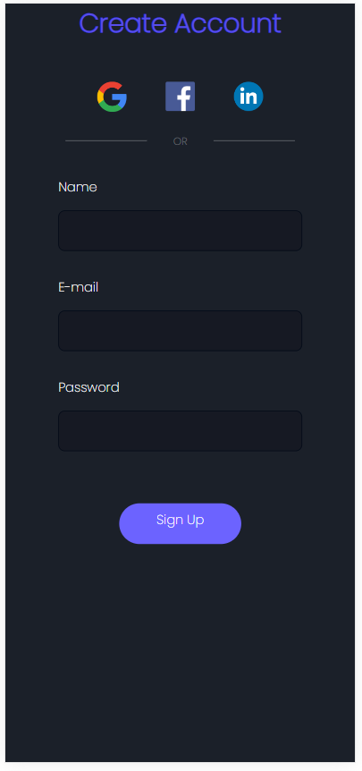
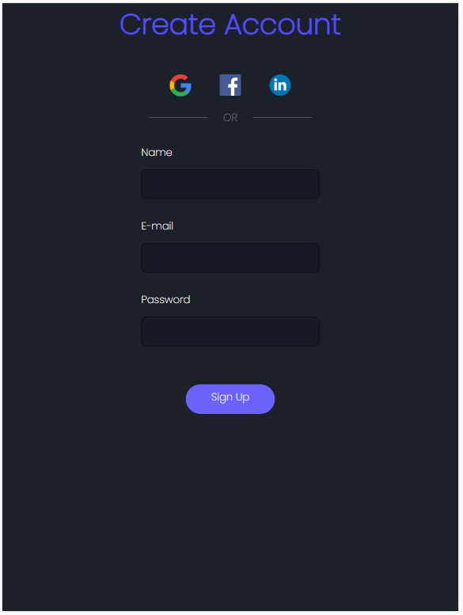

##  SignUp form (Responsive)

This project was made using Youtube tutorial!

  
  Desktop version.

   
  Mobile version.

    
  Mobile version (ipad).

## 🚀 Tecnologias

The project was developed using the following technologies:

- HTML e CSS

## 💻 Projeto
Sign Up form with options to also login using social medias as Facebook, Google or LinkedIn.

Credits: @GiovannaMoeller